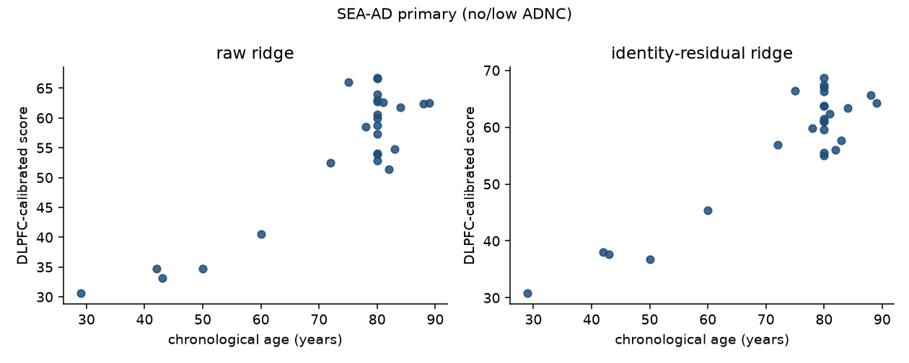

# FINDINGS_EXTERNAL — does the frozen DLPFC age direction transfer to SEA-AD MTG?

**Status:** external transfer scored. Seed `20260914`. SEA-AD `c2876b1b-06d8-4d96-a56b-5304f815b99a`. Primary metric: Pearson r (n_perm=200). **S1 2026-09-17:** reported statistic is Spearman ρ; ≥65-only primary fails.

Does not modify `FINDINGS_LOWDIM.md`, `FINDINGS_GEOMETRY.md`, `FINDINGS_POSCTRL.md`, `FINDINGS_GTEX.md`, `FINDINGS_TARGET.md`, `FINDINGS_TRAJECTORY.md`, `FINDINGS_BRAIN_PHASE1.md`, or `FALSIFICATION.md`. No perturbation data. No TF Atlas. No candidate interventions.

Reproduced by `src/external_run.py`. Cohort: Whole Taxonomy - MTG: Seattle Alzheimer's Disease Atlas (SEA-AD). Tissue: `middle temporal gyrus`. Collection `1ca90a2d-2943-483d-b678-b809bf464c30`.

## Pre-registration (verbatim, written before any fit)

Written **before any DLPFC fit or SEA-AD projection**, 2026-09-17. No threshold in this block is re-tuned after numbers exist.

FINDINGS_POSCTRL.md Supersession 2–3: the DLPFC age direction transfers between HBCC and MSSM as Pearson r (gene_ridge r +0.568 / +0.578; identity-residualized r +0.573 / +0.576; n_perm=200). Uncalibrated transfer R² is a calibration artifact. FINDINGS_GTEX.md: a stable bulk cortex age direction exists in GTEx BA9 (held-out r) and is not driven by recorded logistics.

This cell asks a different question: does the **frozen** DLPFC direction, trained on all 233 DLPFC donors and never fit on SEA-AD, predict chronological age in SEA-AD single-nucleus MTG (Allen Institute; a third bank, region, and lab)?

Two directions are frozen on all 233 DLPFC donors, per cell type, before any SEA-AD score is computed:
- **raw ridge** — global z-score, per-type SVD-LOO ridge age direction (same fitter as POSCTRL gene_ridge / TARGET age companion).
- **identity-residualized ridge** — the G2c / FINDINGS_GEOMETRY Part C 0.317→0.300 fit: type-centroid identity basis on the globally z-scored matrix, residualize, refit ridge age per type.

SEA-AD donor × mapped-type pseudobulks use the same log2(CPM+1) normalization as the DLPFC Phase-1 matrix (`decomp.normalize_logcpm`). Gene overlap is reported. Missing DLPFC genes are left at the DLPFC mean (z=0) so the frozen vector is not rewritten.

**Primary cell:** donors with no or low AD pathology, using the pathology field frozen below from Stage 0 (CERAD, Braak, or ADNC/overall pathology score; not `disease`).
**Secondary cell:** all mapped donors, pathology score as a covariate (partial Pearson r: residualize score and age on the pathology score).

Metric: Pearson r vs chronological age. Donor-level permutation null n_perm=200 (X held fixed; each cell starts a fresh Generator on seed 20260914). Donor-bootstrap 95% percentile CI on the median-over-types r, B=200, seed 20260918. Also report Spearman ρ, calibrated R² (intercept and slope refit on SEA-AD), and uncalibrated R² (DLPFC 1-D calibration applied to SEA-AD). Aggregation: median over mapped cell types with n≥8 donors (POSCTRL S2/S3). Angle is not a gate.

**Pass = r > 0 with permutation-null r ≤ 0.05 in the primary cell.**

Pathology field frozen from Stage 0 (not chosen after seeing r):
- field: `ADNC`
- source file: `https://datasets.cellxgene.cziscience.com/732b4aa7-e441-4196-b05e-127433425613.h5ad`
- no/low levels (primary): ['low', 'not ad', 'reference']
- numeric encoding for the covariate cell: ADNC_or_overall declared ordinal table

## Pre-registered reading (verbatim)

- **pass** (primary r > 0 with null ≤ 0.05) → the direction transfers to a third bank, region, and lab
- **fail** on the primary cell, **pass** on the pathology-covariate cell → transfer is masked by pathology
- **both fail** → does not transfer beyond the two DLPFC banks

Only the outcome that fired is the reading. Do not average primary and secondary.

## Stage 0 — cohort

- dataset_id: `c2876b1b-06d8-4d96-a56b-5304f815b99a`
- title: Whole Taxonomy - MTG: Seattle Alzheimer's Disease Atlas (SEA-AD)
- tissue: `middle temporal gyrus`
- nuclei: 1378211
- donors (CXG): 89
- donors with ≥1 mapped nucleus: **89**
- age range: **29.0–89.0** years (nunique=23)
- sex: {'female': 53, 'male': 36}
- pathology field: `ADNC` (family=ADNC_or_overall)
- pathology levels observed: ['high', 'intermediate', 'low', 'not ad', 'reference']
- no/low pathology donors: 26 (levels=['low', 'not ad', 'reference']; missing=0)
- pathology source: `seaad_h5ad_obs`
- subclasses mapped: 15 / 24
- unmapped subclasses: ['Astrocyte', 'Chandelier', 'Endothelial', 'L5 ET', 'L5/6 NP', 'L6 CT', 'L6b', 'Pax6', 'Sncg']

Unmapped subclasses failed **exact** `cell_type` (and exact DLPFC-subclass) match. Not synonymized: e.g. SEA-AD `astrocyte of the cerebral cortex` ≠ DLPFC `astrocyte`; `near-projecting glutamatergic cortical neuron` ≠ `L5/6 near-projecting glutamatergic neuron`.

CELLxGENE has 5 donors with no row in the Allen donor-metadata xlsx (`['H18.30.001', 'H18.30.002', 'H19.30.001', 'H19.30.002', 'H200.1023']`). They are kept because h5ad `ADNC`/`Braak stage`/`CERAD score` are present (SEA-AD neurotypical-reference set; ADNC level `Reference`). Not dropped.

### Subclass → DLPFC type (exact strings only)

| seaad_subclass | seaad_cell_type | dlpfc_type | mapping_key | n_nuclei | mapped |
|---|---|---|---|---|---|
| Astrocyte | astrocyte of the cerebral cortex | NA | NA | 70009 | False |
| Chandelier | pvalb chandelier GABAergic interneuron | NA | NA | 10928 | False |
| Endothelial | cerebral cortex endothelial cell | NA | NA | 2069 | False |
| L2/3 IT | L2/3-6 intratelencephalic projecting glutamatergic neuron | L2/3-6 intratelencephalic projecting glutamatergic neuron | cell_type_exact | 330085 | True |
| L4 IT | L2/3-6 intratelencephalic projecting glutamatergic neuron | L2/3-6 intratelencephalic projecting glutamatergic neuron | cell_type_exact | 168860 | True |
| L5 ET | L5 extratelencephalic projecting glutamatergic cortical neuron | NA | NA | 2590 | False |
| L5 IT | L2/3-6 intratelencephalic projecting glutamatergic neuron | L2/3-6 intratelencephalic projecting glutamatergic neuron | cell_type_exact | 128090 | True |
| L5/6 NP | near-projecting glutamatergic cortical neuron | NA | NA | 20741 | False |
| L6 CT | corticothalamic-projecting glutamatergic cortical neuron | NA | NA | 18402 | False |
| L6 IT | L2/3-6 intratelencephalic projecting glutamatergic neuron | L2/3-6 intratelencephalic projecting glutamatergic neuron | cell_type_exact | 45252 | True |
| L6 IT Car3 | L2/3-6 intratelencephalic projecting glutamatergic neuron | L2/3-6 intratelencephalic projecting glutamatergic neuron | cell_type_exact | 26129 | True |
| L6b | L6b glutamatergic cortical neuron | NA | NA | 16227 | False |
| Lamp5 | lamp5 GABAergic interneuron | lamp5 GABAergic interneuron | cell_type_exact | 42921 | True |
| Lamp5 Lhx6 | lamp5 GABAergic interneuron | lamp5 GABAergic interneuron | cell_type_exact | 21443 | True |
| Microglia-PVM | microglial cell | microglial cell | cell_type_exact | 40000 | True |
| OPC | oligodendrocyte precursor cell | oligodendrocyte precursor cell | cell_type_exact | 32493 | True |
| Oligodendrocyte | oligodendrocyte | oligodendrocyte | cell_type_exact | 111194 | True |
| Pax6 | caudal ganglionic eminence derived interneuron | NA | NA | 9203 | False |
| Pvalb | pvalb GABAergic interneuron | pvalb GABAergic interneuron | cell_type_exact | 90804 | True |
| Sncg | sncg GABAergic interneuron | NA | NA | 22168 | False |
| Sst | sst GABAergic interneuron | sst GABAergic interneuron | cell_type_exact | 58265 | True |
| Sst Chodl | sst GABAergic interneuron | sst GABAergic interneuron | cell_type_exact | 1496 | True |
| VLMC | vascular leptomeningeal cell | vascular leptomeningeal cell | cell_type_exact | 4328 | True |
| Vip | VIP GABAergic interneuron | VIP GABAergic interneuron | cell_type_exact | 104514 | True |

### n donors per DLPFC type

| dlpfc_type | n_nuclei | n_donors | n_subclasses |
|---|---|---|---|
| L2/3-6 intratelencephalic projecting glutamatergic neuron | 698416 | 89 | 5 |
| VIP GABAergic interneuron | 104514 | 89 | 1 |
| lamp5 GABAergic interneuron | 64364 | 89 | 2 |
| microglial cell | 40000 | 89 | 1 |
| oligodendrocyte | 111194 | 89 | 1 |
| oligodendrocyte precursor cell | 32493 | 89 | 1 |
| pvalb GABAergic interneuron | 90804 | 89 | 1 |
| sst GABAergic interneuron | 59761 | 89 | 2 |
| vascular leptomeningeal cell | 4328 | 87 | 1 |
| GABAergic neuron | 0 | 0 | 0 |
| L2/3 intratelencephalic projecting glutamatergic neuron | 0 | 0 | 0 |
| L5/6 near-projecting glutamatergic neuron | 0 | 0 | 0 |
| L6 corticothalamic-projecting glutamatergic cortical neuron | 0 | 0 | 0 |
| L6 intratelencephalic projecting glutamatergic neuron | 0 | 0 | 0 |
| L6b glutamatergic neuron of the primary motor cortex | 0 | 0 | 0 |
| astrocyte | 0 | 0 | 0 |
| endothelial cell | 0 | 0 | 0 |
| pericyte | 0 | 0 | 0 |
| perivascular macrophage | 0 | 0 | 0 |
| smooth muscle cell | 0 | 0 | 0 |

### Columns actually read

- `donor_metadata_xlsx`: ['Donor ID', 'Primary Study Name', 'Secondary Study Name', 'Age at Death', 'Sex', 'Race (choice=White)', 'Race (choice=Black/ African American)', 'Race (choice=Asian)', 'Race (choice=American Indian/ Alaska Native)', 'Race (choice=Native Hawaiian or Pacific Islander)', 'Race (choice=Unknown or unreported)', 'Race (choice=Other)', 'specify other race', 'Hispanic/Latino', 'Highest level of education', 'Years of education', 'APOE Genotype', 'Cognitive Status', 'Age of onset cognitive symptoms', 'Age of Dementia diagnosis', 'Known head injury', 'Have they had neuroimaging', 'Consensus Clinical Dx (choice=Alzheimers disease)', 'Consensus Clinical Dx (choice=Alzheimers Possible/ Probable)', 'Consensus Clinical Dx (choice=Ataxia)', 'Consensus Clinical Dx (choice=Corticobasal Degeneration)', 'Consensus Clinical Dx (choice=Control)', 'Consensus Clinical Dx (choice=Dementia with Lewy Bodies/ Lewy Body Disease)', 'Consensus Clinical Dx (choice=Frontotemporal lobar degeneration)', 'Consensus Clinical Dx (choice=Huntingtons disease)', 'Consensus Clinical Dx (choice=Motor Neuron disease)', 'Consensus Clinical Dx (choice=Multiple System Atrophy)', 'Consensus Clinical Dx (choice=Parkinsons disease)', 'Consensus Clinical Dx (choice=Parkinsons Cognitive Impairment - no dementia)', 'Consensus Clinical Dx (choice=Parkinsons Disease Dementia)', 'Consensus Clinical Dx (choice=Prion)', 'Consensus Clinical Dx (choice=Progressive Supranuclear Palsy)', 'Consensus Clinical Dx (choice=Taupathy)', 'Consensus Clinical Dx (choice=Vascular Dementia)', 'Consensus Clinical Dx (choice=Unknown)', 'Consensus Clinical Dx (choice=Other)', 'If other Consensus dx, describe', 'Last CASI Score', 'Interval from last CASI in months', 'Last MMSE Score', 'Interval from last MMSE in months', 'Last MOCA Score', 'Interval from last MOCA in months', 'PMI', 'Rapid Frozen Tissue Type', 'Ex Vivo Imaging', 'Fresh Brain Weight', 'Brain pH', 'Overall AD neuropathological Change', 'Thal', 'Braak', 'CERAD score', 'Overall CAA Score', 'Highest Lewy Body Disease', 'Total Microinfarcts (not observed grossly)', 'Total microinfarcts in screening sections', 'Atherosclerosis', 'Arteriolosclerosis', 'LATE', 'RIN', 'Severely Affected Donor']
- `seaad_h5ad_obs`: ['assay_ontology_term_id', 'cell_type_ontology_term_id', 'disease_ontology_term_id', 'self_reported_ethnicity_ontology_term_id', 'sex_ontology_term_id', 'tissue_ontology_term_id', 'is_primary_data', 'Neurotypical reference', 'Class', 'Subclass', 'Supertype', 'Age at death', 'Years of education', 'Cognitive status', 'ADNC', 'Braak stage', 'Thal phase', 'CERAD score', 'APOE4 status', 'Lewy body disease pathology', 'LATE-NC stage', 'Microinfarct pathology', 'Specimen ID', 'donor_id', 'PMI', 'Number of UMIs', 'Genes detected', 'Fraction mitochrondrial UMIs', 'suspension_type', 'development_stage_ontology_term_id', 'Continuous Pseudo-progression Score', 'tissue_type', 'cell_type', 'assay', 'disease', 'sex', 'tissue', 'self_reported_ethnicity', 'development_stage', 'observation_joinid']
- `donor_metadata_join_key`: Donor ID

## Gene overlap

DLPFC genes=25526  SEA-AD genes=35483  overlap=**22939**  fraction=0.8986523544621171  DLPFC genes absent from SEA-AD=2587.
Missing DLPFC genes are left at the DLPFC mean (z=0). The frozen vector is not rewritten.

## Transfer

| cell | r | r_null | p | ρ | calR² | R² | r 95% CI | pass | n_donors | n_types | n_perm |
|---|---|---|---|---|---|---|---|---|---|---|---|
| raw primary (no/low pathology) | +0.877 | +0.004 | +0.005 | +0.478 | +0.769 | -0.665 | [+0.639, +0.942] | True | 26 | 9 | 200 |
| raw secondary (pathology covariate) | +0.687 | +0.003 | +0.005 | +0.407 | +0.472 | +0.441 | [+0.396, +0.806] | True | 89 | 9 | 200 |
| idresid primary (no/low pathology) | +0.873 | +0.003 | +0.005 | +0.491 | +0.762 | -0.476 | [+0.652, +0.943] | True | 26 | 9 | 200 |
| idresid secondary (pathology covariate) | +0.698 | +0.003 | +0.005 | +0.430 | +0.487 | +0.474 | [+0.406, +0.818] | True | 89 | 9 | 200 |

## Verdict

**The direction transfers to a third bank, region, and lab.**

Same reading on both frozen directions (raw and identity-residualized). Do not average.
Pearson r is the gate (POSCTRL S2/S3). Uncalibrated R² is a calibration artifact (negative in the primary cell, as in HBCC↔MSSM). Spearman ρ is lower than r because SEA-AD chronological age is HsapDv integer-year bins (23 unique ages, 29–89).

- **raw:** the direction transfers to a third bank, region, and lab. primary r=+0.877 (null +0.004, CI [+0.639, +0.942], pass=True); secondary r=+0.687 (null +0.003, pass=True).
- **idresid:** the direction transfers to a third bank, region, and lab. primary r=+0.873 (null +0.003, CI [+0.652, +0.943], pass=True); secondary r=+0.698 (null +0.003, pass=True).

Figure: `results/external/figures/primary_score_vs_age.png`

### raw primary per type

| celltype | n | r | rho | r2 | cal_r2 | ok |
|---|---|---|---|---|---|---|
| L2/3-6 intratelencephalic projecting glutamatergic neuron | 26 | +0.921 | +0.567 | -1.075 | +0.849 | True |
| VIP GABAergic interneuron | 26 | +0.909 | +0.520 | -1.693 | +0.827 | True |
| lamp5 GABAergic interneuron | 26 | +0.908 | +0.466 | -0.665 | +0.825 | True |
| microglial cell | 24 | +0.877 | +0.315 | -0.062 | +0.769 | True |
| oligodendrocyte | 24 | +0.867 | +0.520 | -0.613 | +0.752 | True |
| oligodendrocyte precursor cell | 24 | +0.843 | +0.292 | -0.252 | +0.710 | True |
| pvalb GABAergic interneuron | 26 | +0.896 | +0.478 | -0.220 | +0.803 | True |
| sst GABAergic interneuron | 26 | +0.863 | +0.494 | -1.848 | +0.745 | True |
| vascular leptomeningeal cell | 21 | +0.605 | +0.473 | -4.413 | +0.367 | True |

### idresid primary per type

| celltype | n | r | rho | r2 | cal_r2 | ok |
|---|---|---|---|---|---|---|
| L2/3-6 intratelencephalic projecting glutamatergic neuron | 26 | +0.929 | +0.576 | +0.181 | +0.864 | True |
| VIP GABAergic interneuron | 26 | +0.912 | +0.523 | -1.758 | +0.832 | True |
| lamp5 GABAergic interneuron | 26 | +0.912 | +0.480 | -0.581 | +0.832 | True |
| microglial cell | 24 | +0.873 | +0.331 | -0.163 | +0.762 | True |
| oligodendrocyte | 24 | +0.866 | +0.519 | -0.476 | +0.750 | True |
| oligodendrocyte precursor cell | 24 | +0.846 | +0.303 | -0.302 | +0.715 | True |
| pvalb GABAergic interneuron | 26 | +0.899 | +0.491 | -0.156 | +0.808 | True |
| sst GABAergic interneuron | 26 | +0.869 | +0.478 | -1.826 | +0.755 | True |
| vascular leptomeningeal cell | 21 | +0.643 | +0.524 | -4.759 | +0.413 | True |

## What this changes in FINDINGS_LOWDIM L4 (quote, not edited)

**The negative result stands.** What would be needed to change it: more donors per cell type (so that even gene space is not p ≫ n, or so that a k ≪ n space is estimated from hundreds of independent brains rather than ~200); **more sites** (two banks are one degree of freedom of transfer, and that transfer failed); or a **different tissue** with less bank structure and more independent donors. Re-fitting more unsupervised variants on this same 233-donor DLPFC matrix will not make an underdetermined direction unique.

## Limitations

1. **Age range:** SEA-AD MTG donors span 29.0–89.0 years (nunique=23). The DLPFC clock was fit on adult controls 20–89. Do not extrapolate outside the overlapping range.
2. **Region:** SEA-AD is **middle temporal gyrus**, not DLPFC. A pass is transfer across bank, region, and lab; a fail confounds region with cohort.
3. **Pathology:** primary cell uses `ADNC` (family=ADNC_or_overall); no/low levels=['low', 'not ad', 'reference']. SEA-AD is an AD-spectrum cohort. Unmapped subclasses are excluded, not imputed.
4. Two DLPFC banks (HBCC, MSSM) trained the direction; SEA-AD is a third cohort, never in the fit.
5. Unmapped SEA-AD subclasses are reported, not synonymized onto the 20 DLPFC types. 11 of 20 DLPFC types have zero mapped SEA-AD donors (astrocyte, endothelium, several glutamatergic subclasses).
6. Primary n=26. Pearson r is leverage-sensitive to the younger tail (neurotypical-reference donors ~30–60 y); Spearman ρ is the rank-robust companion and is reported alongside. The gate is Pearson r.
7. Seed `20260914` (permutation); donor-bootstrap seed `20260918`. n_perm=200, n_boot=200.
8. Same log2(CPM+1) as the DLPFC Phase-1 matrix. Gene overlap is incomplete; missing genes are z=0.

## Files

| path | content |
|---|---|
| `src/external_common.py`, `external_stage0.py`, `external_freeze.py`, `external_project.py`, `external_download.py`, `external_findings.py`, `external_run.py` | code |
| `results/external/` | manifest, mapping, frozen directions, primary/secondary cells |
| `FINDINGS_EXTERNAL.md` | this file |
| `PROGRESS_EXTERNAL.md` | resume state |

## Supersession 1 — 2026-09-17

Written **before any ≥65-only fit and before any ρ permutation or ρ bootstrap**. The original pre-registered block and the Pearson-r verdict above are kept for the record. No threshold in this block is re-tuned after numbers exist.

The original primary cell (no/low ADNC, n=26) passed Pearson r because a younger tail (five neurotypical-reference donors, ages 29–60) sits apart from a pile of donors at 72–89. Spearman ρ was reported but was not the gate, and it had no permutation null and no bootstrap CI. That is the same class of reporting gap S3 closed for r.

This supersession does not retune the original r bar. It answers whether the **rank** association survives (i) a proper null and CI on ρ, and (ii) dropping the <65 tail.

**Reported statistic:** Spearman ρ (median over mapped cell types with n≥8). Pearson r, calibrated R², and uncalibrated R² remain in the table; they are not gates.

**Null and interval:** donor-level permutation null n_perm=200 (X/pred held fixed; each cell starts a fresh Generator on seed `20260914`). Donor-bootstrap 95% percentile CI on the median-over-types ρ, B=200, seed `20260918`. Same seeds as the original cell.

**Cells (frozen scores; no DLPFC refit, no SEA-AD refit):**
1. **Original primary, ρ-gated.** Same 26 no/low-ADNC donors. Recompute the permutation null and bootstrap CI on ρ instead of r.
2. **≥65-only primary.** Restrict cell (1) to donors with chronological age ≥ 65 years. Same no/low ADNC rule. Same frozen predictions. Do not widen to high-ADNC donors to keep n.

**Pass = ρ > 0 with permutation-null ρ ≤ 0.05.** If a cell has fewer than 8 donors after the restriction, STOP that cell; do not lower the n bar.

Reading (only the outcome that fired; do not average cells or directions):
- **both pass** → the original third-bank reading stands under rank correlation and at overlapping old ages
- **original primary ρ passes, ≥65 fails** → transfer is carried by the younger donors; do not read Pearson r as transfer at ≥65
- **both fail** → the Pearson pass does not survive rank correlation; do not read it as third-bank transfer of a linear age axis
- **original primary ρ fails, ≥65 passes** → report that mixed result; do not average

**Per-cell-type ρ table** (existing scores; not a new fit): one row per DLPFC Phase-1 type. Columns are Spearman ρ for (a) DLPFC bank transfer HBCC→MSSM and MSSM→HBCC from `results/posctrl/s3_gene_ridge_transfer_per_type.csv` (real-age gene_ridge; n_perm=200 cell already run), (b) SEA-AD original primary raw and identity-residual, (c) GTEx T3. GTEx T3 is bulk cortex, not snRNA and not a cell type — it is one extra row labeled as bulk, not copied onto 20 types. Types with n<8 in a column are NA. Do not synonymize unmapped SEA-AD types.

### S1 ρ — original primary (no/low ADNC, n=26)

Frozen scores. Permutation null and bootstrap CI are on **ρ**, not r. Pass = ρ > 0 with null ≤ 0.05.

| direction | ρ | ρ_null | p | ρ 95% CI | pass | r | n_donors | n_types | n_perm |
|---|---:|---:|---:|---|---|---:|---:|---:|---:|
| raw | +0.478 | +0.002 | +0.005 | [+0.026, +0.742] | True | +0.877 | 26 | 9 | 200 |
| idresid | +0.491 | +0.002 | +0.005 | [+0.074, +0.741] | True | +0.873 | 26 | 9 | 200 |

Same reading on both directions. Do not average.

### S1 ≥65-only primary (no/low ADNC and age ≥ 65, n=21)

21 donors, 10 unique ages; 12 of 21 sit in the 80-year HsapDv bin. Frozen scores; no DLPFC refit.

| direction | ρ | ρ_null | p | ρ 95% CI | pass | r | calR² | n_donors | n_types | n_perm |
|---|---:|---:|---:|---|---|---:|---:|---:|---:|---:|
| raw | −0.009 | +0.017 | +0.557 | [−0.348, +0.337] | False | +0.067 | +0.006 | 21 | 9 | 200 |
| idresid | −0.014 | +0.015 | +0.567 | [−0.301, +0.333] | False | +0.082 | +0.007 | 21 | 9 | 200 |

#### ≥65 raw per type

| celltype | n | r | ρ | calR² |
|---|---:|---:|---:|---:|
| L2/3-6 intratelencephalic projecting glutamatergic neuron | 21 | +0.264 | +0.142 | +0.070 |
| VIP GABAergic interneuron | 21 | +0.026 | +0.048 | +0.001 |
| lamp5 GABAergic interneuron | 21 | −0.011 | −0.064 | +0.000 |
| microglial cell | 21 | −0.046 | −0.059 | +0.002 |
| oligodendrocyte | 21 | +0.394 | +0.260 | +0.155 |
| oligodendrocyte precursor cell | 21 | +0.067 | −0.094 | +0.005 |
| pvalb GABAergic interneuron | 21 | +0.082 | −0.037 | +0.007 |
| sst GABAergic interneuron | 21 | −0.079 | −0.009 | +0.006 |
| vascular leptomeningeal cell | 19 | +0.326 | +0.294 | +0.106 |

#### ≥65 identity-residual per type

| celltype | n | r | ρ | calR² |
|---|---:|---:|---:|---:|
| L2/3-6 intratelencephalic projecting glutamatergic neuron | 21 | +0.265 | +0.160 | +0.070 |
| VIP GABAergic interneuron | 21 | +0.052 | +0.054 | +0.003 |
| lamp5 GABAergic interneuron | 21 | +0.018 | −0.035 | +0.000 |
| microglial cell | 21 | −0.044 | −0.035 | +0.002 |
| oligodendrocyte | 21 | +0.386 | +0.259 | +0.149 |
| oligodendrocyte precursor cell | 21 | +0.085 | −0.076 | +0.007 |
| pvalb GABAergic interneuron | 21 | +0.082 | −0.014 | +0.007 |
| sst GABAergic interneuron | 21 | −0.082 | −0.041 | +0.007 |
| vascular leptomeningeal cell | 19 | +0.333 | +0.364 | +0.111 |

### Verdict (supersession 1)

**Original primary ρ passes, ≥65 fails → transfer is carried by the younger donors; do not read Pearson r as transfer at ≥65.**

Same reading on both frozen directions. Do not average. Pearson r itself also collapses at ≥65 (raw +0.067, idresid +0.082). The original primary ρ 95% CI still excludes 0 but is wide ([+0.026, +0.742] raw). Five neurotypical-reference donors aged 29–60 are the leverage.

### Per-cell-type Spearman ρ

DLPFC bank transfer is POSCTRL S3 `gene_ridge` real age (`results/posctrl/s3_gene_ridge_transfer_per_type.csv`). SEA-AD is the original no/low-ADNC primary. n<8 → NA. GTEx T3 is bulk cortex (no cell types) and is not copied onto the 20 rows.

| celltype | ρ H→M | n_te | ρ M→H | n_te | ρ SEA-AD raw | n | ρ SEA-AD idresid | n |
|---|---:|---:|---:|---:|---:|---:|---:|---:|
| GABAergic neuron | +0.526 | 83 | +0.488 | 96 | NA | NA | NA | NA |
| L2/3 intratelencephalic projecting glutamatergic neuron | +0.805 | 108 | +0.873 | 112 | NA | NA | NA | NA |
| L2/3-6 intratelencephalic projecting glutamatergic neuron | +0.756 | 104 | +0.835 | 111 | +0.567 | 26 | +0.576 | 26 |
| L5/6 near-projecting glutamatergic neuron | +0.501 | 42 | +0.430 | 82 | NA | NA | NA | NA |
| L6 corticothalamic-projecting glutamatergic cortical neuron | +0.579 | 68 | +0.587 | 85 | NA | NA | NA | NA |
| L6 intratelencephalic projecting glutamatergic neuron | +0.568 | 64 | +0.620 | 86 | NA | NA | NA | NA |
| L6b glutamatergic neuron of the primary motor cortex | +0.484 | 36 | +0.495 | 73 | NA | NA | NA | NA |
| VIP GABAergic interneuron | +0.644 | 105 | +0.680 | 112 | +0.520 | 26 | +0.523 | 26 |
| astrocyte | +0.715 | 112 | +0.673 | 117 | NA | NA | NA | NA |
| endothelial cell | +0.240 | 51 | −0.034 | 109 | NA | NA | NA | NA |
| lamp5 GABAergic interneuron | +0.557 | 96 | +0.487 | 109 | +0.466 | 26 | +0.480 | 26 |
| microglial cell | +0.581 | 107 | +0.459 | 112 | +0.315 | 24 | +0.331 | 24 |
| oligodendrocyte | +0.602 | 112 | +0.647 | 120 | +0.520 | 24 | +0.519 | 24 |
| oligodendrocyte precursor cell | +0.731 | 113 | +0.717 | 119 | +0.292 | 24 | +0.303 | 24 |
| pericyte | +0.289 | 46 | +0.230 | 90 | NA | NA | NA | NA |
| perivascular macrophage | −0.611 | 9 | −0.176 | 22 | NA | NA | NA | NA |
| pvalb GABAergic interneuron | +0.591 | 99 | +0.567 | 110 | +0.478 | 26 | +0.491 | 26 |
| smooth muscle cell | NA | 4 | NA | 12 | NA | NA | NA | NA |
| sst GABAergic interneuron | +0.674 | 95 | +0.732 | 111 | +0.494 | 26 | +0.478 | 26 |
| vascular leptomeningeal cell | +0.187 | 21 | +0.182 | 60 | +0.473 | 21 | +0.524 | 21 |

GTEx T3 bulk (ridge, raw; not a cell type). BA9→Cortex ρ **+0.441** (null +0.012, n_test=270). Cortex→BA9 ρ **+0.318** (null −0.002, n_test=269). Both T3 ridge directions pass the GTEx r bar; pls1 is not averaged in (FINDINGS_GTEX.md).

On the 9 types present in SEA-AD, DLPFC H→M ρ is higher than SEA-AD primary ρ for oligodendrocyte precursor cell (+0.731 vs +0.292) and microglia (+0.581 vs +0.315); VLMC is the reverse (DLPFC +0.187 vs SEA-AD +0.473). That is a description of the table, not a new test.

