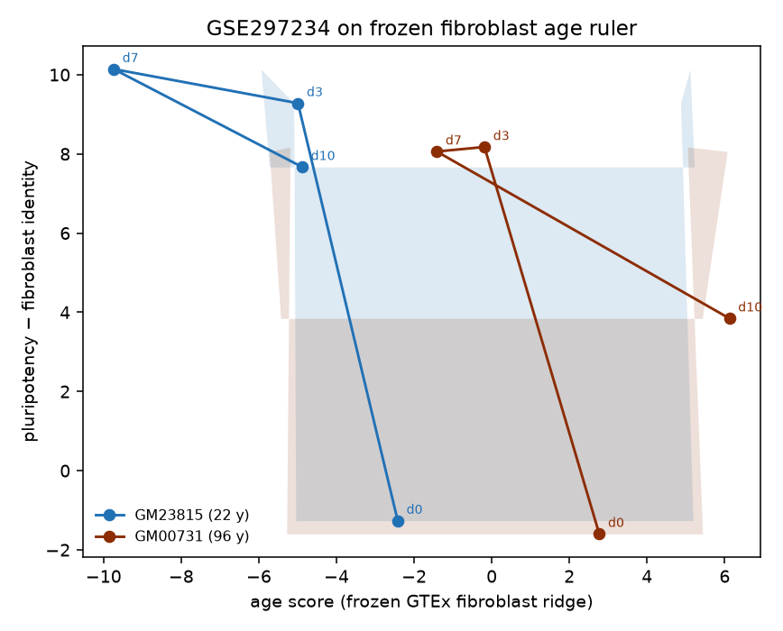

# FINDINGS_FIBRO — fibroblast age ruler, then the reprogramming curve

**Status:** Stage 2 complete (outcome `no_decline`). Seed `20260914`. boot `20260918`. GTEx Analysis V10 (RNASeQCv2.4.2; phs000424.v10). Primary Stage 1 metric: Spearman ρ (n_perm=200). Stage 2 random-direction n=200.

Does not modify any existing `FINDINGS_*.md` or `FALSIFICATION.md`. No GSE325735. Uncalibrated R² is reported and is never a gate. PLS-1 is reported and is not averaged with ridge.

Reproduced by `src/fibro_run.py`. Freeze: `SMAFRZE==RNASEQ`. Tissue: `Cells - Cultured fibroblasts`.

## Stage 1 pre-registration (verbatim, written before any Stage 1 fit)

Written **before any Stage 1 fit**, 2026-09-17. No threshold in this block is re-tuned after numbers exist.

Cohort: GTEx Analysis V10 RNASEQ freeze (`SMAFRZE==RNASEQ`), `SMTSD == "Cells - Cultured fibroblasts"`.
One sample per donor. Target = public `AGE` bin midpoint. Model = SVD-LOO ridge (same fitter as
POSCTRL gene_ridge / TARGET age companion). PLS-1 is fit and reported; it is **not** averaged with
ridge (GTEx T3: PLS-1 has an inflated null).

Preprocessing (FINDINGS_GTEX.md Stage 0, verbatim): gene filter ≥6 counts in ≥20% of samples;
TMM/edgeR log2-CPM (`prior.count=2`); per-gene z-score on training rows only.

Covariate regimes `raw` and `resid`. `resid` columns: `SMRIN`, `SMTSISCH`, `DTHHRDY` one-hot, `SEX`,
residualized on training rows only. `resid` is reported alongside `raw`; it is not a gate.

Within-site CV grouped by `SMNABTCH` (batch-held-out). Donor-held-out is asserted in the same folds
(one sample per donor). Metrics: Spearman ρ, donor-level permutation null (n_perm=200, seed `20260914`),
donor-bootstrap 95% percentile CI (B=200, seed `20260918`), calibrated R², uncalibrated R².
Pearson r is reported and is not a gate.

Transfer: B1→C1 and C1→B1 (`SMCENTER`). D1 is too small and is excluded, stated, not silently dropped.

**Stage 1 pass = ρ > 0 in both transfer directions with permutation-null ρ ≤ 0.05, in `raw`, ridge.**
If Stage 1 fails, STOP. Do not open GSE297234. The fibroblast ruler does not transfer between GTEx
sites, so a reprogramming projection would be uninterpretable.

GTEx public `AGE` is a 10-year bin, so ρ is against a coarse ordinal target and year-level error is
not meaningful. Gene-universe overlap with the DLPFC 25526-gene matrix (Ensembl, version-stripped)
is reported before Stage 2.

Flag: `results/fibro/PREREG_STAGE1.flag` exists=True.

**Caveat:** GTEx public `AGE` is a 10-year bin, so ρ is against a coarse ordinal target and year-level error is not meaningful.

## STOP / failures

Not substituting columns or repairing rows.

- **download:** https://ftp.ncbi.nlm.nih.gov/geo/series/GSE297nnn/GSE297234/suppl/GSE297234_GM00731_SEVOSKM.rds: RuntimeError: failed to download https://ftp.ncbi.nlm.nih.gov/geo/series/GSE297nnn/GSE297234/suppl/GSE297234_GM00731_SEVOSKM.rds
- **download:** https://ftp.ncbi.nlm.nih.gov/geo/series/GSE297nnn/GSE297234/suppl/GSE297234_HFIB_COMBINED_SEVOSKM.rds: RuntimeError: failed to download https://ftp.ncbi.nlm.nih.gov/geo/series/GSE297nnn/GSE297234/suppl/GSE297234_HFIB_COMBINED_SEVOSKM.rds
- **10x:** no 10x matrix/features/barcodes triplets in GSE297234_RAW.tar. RDS present but R/pyreadr are not available; not substituting a fitted object.
The earlier MTX-triplet stop was a format mismatch; Cell Ranger `filtered_feature_bc_matrix.h5` in `GSE297234_RAW.tar` was used. Seurat `.rds` files were listed on GEO and not loaded.

## Stage 1 — cohort

- SMTSD `Cells - Cultured fibroblasts`  n_samples=652  n_donors=652  one sample per donor.
- SMCENTER (file strings): `{'B1': 421, 'C1': 224, 'D1': 7}`  n_SMNABTCH=72  n_SMGEBTCH=90
- SEX 1/2 (GTEx coding) = 436/216
- SMRIN median 9.90 (6.70–10.00, miss=0)
- SMTSISCH median 499.0 (-597.0–1678.0, miss=17)
- DTHHRDY miss=13
- D1 n=7. D1 n is too small for a transfer cell; excluded from B1↔C1 transfer and from within-site CV, stated, not silently dropped from the cohort table.

AGE bins (n samples):

| 20-29 | 30-39 | 40-49 | 50-59 | 60-69 | 70-79 |
|---:|---:|---:|---:|---:|---:|
| 60 | 53 | 106 | 202 | 210 | 21 |

Columns actually read:

- sample_attributes: ['SAMPID', 'SMATSSCR', 'SMCENTER', 'SMPTHNTS', 'SMRIN', 'SMTS', 'SMTSD', 'SMUBRID', 'SMTSISCH', 'SMTSPAX', 'SMNABTCH', 'SMNABTCHT', 'SMNABTCHD', 'SMGEBTCH', 'SMGEBTCHD', 'SMGEBTCHT', 'ANALYTE_TYPE', 'SMAFRZE', 'SMGTC', 'SMRDTTL', 'SMALTTL', 'SMALTALG', 'SMSUPALG', 'SMRDLGTH', 'SMVQCFL', 'SMLMAPQ', 'SMUMPRD', 'SMUNPDRD', 'SMMPPD', 'SMMAPRT', 'SMMPPDUN', 'SMUNMPRT', 'SMMPDP', 'SMDPMPRT', 'SMMPPDXG', 'SMMPDPXG', 'SMDPRTXG', 'SMCHMRD', 'SMCHMRT', 'SMMPPDPR', 'SMMPHQRD', 'SMMPHQRT', 'SMMPLQRD', 'SMSPLTRT', 'SME1MPRD', 'SME2MPRD', 'SME1MPRT', 'SME2MPRT', 'SME1MMB', 'SME2MMB', 'SME1TTLB', 'SME2TTLB', 'SME1MMRT', 'SME2MMRT', 'SMTTLMM', 'SMTTLB', 'SMBSMMRT', 'SMESTLBS', 'SMEXNCRD', 'SMEXNCRT', 'SMEXPEFF', 'SMNTRNRD', 'SMNTRNRT', 'SMNTRARD', 'SMNTRART', 'SMNTERRD', 'SMNTERRT', 'SMAMBRD', 'SMAMBRT', 'SMNTEXC', 'SMDSCRT', 'SMEXNCRTHQ', 'SMNTRNRTHQ', 'SMNTRARTHQ', 'SMNTERRTHQ', 'SMAMBRTHQ', 'SME1SNSE', 'SME2SNSE', 'SME1ANTI', 'SME2ANTI', 'SME1PCTS', 'SME2PCTS', 'SMGNSDTC', 'SMRRNARD', 'SMRRNART', 'SMMFLGTH', 'SMSFLGTH', 'SMMDFLGTH', 'SMSMFLGTH', 'SMFGCMN', 'SMFGCSD', 'SMFGCSK', 'SMFGCKT', 'SM3PBMN', 'SM3PBSD', 'SM3PBMD', 'SM3PB25P', 'SM3PB75P', 'SM3PBSDM', 'SM3PBGN', 'SMMDMNCV', 'SMMDCVSD', 'SMMDCVCV', 'SMEXCVMD', 'SMEXCVMAD', 'SMMNCV', 'SMUVCRD', 'SMUVCRT', 'SMSHRTRD', 'SMSHRTRT', 'SMSMRDHQ', 'SMSMRTHQ', 'SMPRERDHQ', 'SMPRERTHQ', 'SMSMGNDT', 'SMPREGNDT', 'SMRDLNMN', 'SMRDLNMD', 'SMRDLNSD']
- subject_phenotypes: ['SUBJID', 'SEX', 'AGE', 'DTHHRDY']

## Stage 1 — gene filter and DLPFC overlap

- n_genes_raw=59033  n_genes_filter=23485  n_overlap_dlpfc=17791  DLPFC n=25526
- filter: >=6 counts in >=20% of samples  normalization: TMM then log2-CPM prior.count=2
- DLPFC columns actually read: ['gene_id', 'symbol']

## Stage 1 — within-site CV (SMNABTCH-grouped; batch-held-out and donor-held-out asserted)

Every cell has its permutation null. Uncalibrated R² is not a gate.

| site | regime | method | rho | rho_null | rho_p | rho_ci_lo | rho_ci_hi | cal_r2 | r2 | r | n | n_perm | pass_rho |
|---|---|---|---|---|---|---|---|---|---|---|---|---|---|
| B1 | raw | ridge | +0.549 | -0.010 | +0.005 | +0.481 | +0.604 | +0.303 | +0.302 | +0.551 | 421 | 200 | True |
| B1 | raw | pls1 | +0.183 | +0.005 | +0.005 | +0.085 | +0.271 | +0.039 | +0.032 | +0.198 | 421 | 200 | True |
| B1 | resid | ridge | +0.246 | -0.016 | +0.005 | +0.162 | +0.327 | +0.072 | +0.071 | +0.269 | 421 | 200 | True |
| B1 | resid | pls1 | -0.002 | +0.003 | +0.537 | -0.088 | +0.093 | +0.003 | -0.030 | +0.059 | 421 | 200 | False |
| C1 | raw | ridge | +0.355 | -0.021 | +0.005 | +0.211 | +0.464 | +0.113 | +0.101 | +0.337 | 224 | 200 | True |
| C1 | raw | pls1 | +0.139 | +0.005 | +0.040 | -0.014 | +0.257 | +0.018 | -0.006 | +0.133 | 224 | 200 | True |
| C1 | resid | ridge | +0.212 | -0.024 | +0.005 | +0.090 | +0.334 | +0.031 | +0.017 | +0.175 | 224 | 200 | True |
| C1 | resid | pls1 | +0.060 | -0.001 | +0.229 | -0.093 | +0.192 | +0.010 | -0.018 | +0.098 | 224 | 200 | True |

Skipped sites: `[{'skipped': True, 'site': 'D1', 'n': 7, 'reason': 'n<10'}]`

## Stage 1 — B1↔C1 transfer

D1 excluded (stated). PLS-1 is not averaged with ridge.

| direction | regime | method | rho | rho_null | rho_p | rho_ci_lo | rho_ci_hi | cal_r2 | r2 | r | n_train | n_test | n_perm | pass_rho |
|---|---|---|---|---|---|---|---|---|---|---|---|---|---|---|
| B1→C1 | raw | ridge | +0.529 | -0.004 | +0.005 | +0.418 | +0.612 | +0.353 | +0.289 | +0.594 | 421 | 224 | 200 | True |
| C1→B1 | raw | ridge | +0.561 | +0.013 | +0.005 | +0.500 | +0.617 | +0.312 | +0.251 | +0.559 | 224 | 421 | 200 | True |
| B1→C1 | raw | pls1 | +0.218 | +0.009 | +0.005 | +0.097 | +0.324 | +0.040 | -0.091 | +0.200 | 421 | 224 | 200 | True |
| C1→B1 | raw | pls1 | +0.236 | -0.001 | +0.005 | +0.135 | +0.317 | +0.056 | -0.040 | +0.238 | 224 | 421 | 200 | True |
| B1→C1 | resid | ridge | +0.394 | +0.016 | +0.005 | +0.281 | +0.484 | +0.187 | +0.064 | +0.432 | 421 | 224 | 200 | True |
| C1→B1 | resid | ridge | +0.430 | +0.002 | +0.005 | +0.362 | +0.498 | +0.197 | +0.068 | +0.444 | 224 | 421 | 200 | True |
| B1→C1 | resid | pls1 | +0.146 | +0.019 | +0.030 | +0.007 | +0.276 | +0.026 | -0.113 | +0.162 | 421 | 224 | 200 | True |
| C1→B1 | resid | pls1 | +0.066 | -0.009 | +0.179 | -0.033 | +0.152 | +0.025 | -0.098 | +0.157 | 224 | 421 | 200 | True |

## Stage 1 gate outcome

- pass=True  method=ridge  regime=raw
- B1→C1 ρ=+0.529 (null -0.004 p=+0.005 CI=[+0.418, +0.612]) calR²=+0.353 R²=+0.289 pass=True
- C1→B1 ρ=+0.561 (null +0.013 p=+0.005 CI=[+0.500, +0.617]) calR²=+0.312 R²=+0.251 pass=True
- reason: Stage 1 pass: ridge raw ρ>0 both ways with null ≤ 0.05 (B1→C1 ρ=+0.529 null=-0.004 p=+0.005; C1→B1 ρ=+0.561 null=+0.013 p=+0.005).

## Stage 2 pre-registration (verbatim, written before the first projection; gated on Stage 1)

Written **before the first GSE297234 projection**, 2026-09-17. No threshold in this block is re-tuned after numbers exist. Stage 2 runs only if Stage 1 passed. Nothing is fitted, refitted, or calibrated on GSE297234.

Frozen age ruler: SVD-LOO ridge, `raw`, fit on **all** GTEx V10 RNASEQ cultured-fibroblast donors (including D1) after Stage 1 passed. Weights, train mean, and train sd are frozen. Missing overlap genes are left at z=0 (FINDINGS_EXTERNAL.md rule). Same TMM/edgeR log2-CPM (`prior.count=2`) as the GTEx matrix, genes restricted to the overlap.

Dataset: GSE297234. Verify the sample table from the record before use. Expected (scoping): Sendai OSKM, primary dermal fibroblasts, days 0 / 3 / 7 / 10, donors GM23815 age 22 and GM00731 age 96. If the record differs, report the discrepancy and use the record. Do not infer a donor age that is not in the record.

Two coordinates:
- Age: pseudobulk per (donor × timepoint). (a) all-cell pseudobulk is primary. (b) unsupervised cluster within each donor × timepoint (PCA 20 PCs on log1p-CP10k of overlap genes, k-means k=3, seed `20260914`; skip a group if n_cells < 50). (b) is reported and never averaged into (a).
- Differentiation / pluripotency: mean z of frozen endogenous set (POU5F1, NANOG, LIN28A, SALL4, DPPA4, ZFP42, DNMT3B) minus mean z of frozen fibroblast-identity set (COL1A1, COL1A2, THY1, S100A4, FN1, VIM, POSTN). z is per-gene across the scored (a) pseudobulks (and separately for (b)). Lists frozen before scoring.

Sendai transgene contamination is a hard requirement. Before any score: check whether the processed matrix contains Sendai/vector features; report what is found. Report the pluripotency score both with and without POU5F1 and any other OSKM-family gene in the endogenous set. If the two disagree, the without-OSKM version is primary.

Day-0 sanity check: with no reprogramming yet, the 96-year donor must score higher on the age ruler than the 22-year donor. Two donors is one comparison and proves nothing statistically — but if it fails, report it and treat every downstream number as suspect.

Primary question: in the aged donor (GM00731), does the age score decline monotonically across days 0 → 3 → 7 → 10?

Primary null — random directions: draw 200 unit vectors in the same gene space, matched to the frozen ruler's weight distribution (permute the ruler's weights across genes; seed `20260914`). Score every (a) pseudobulk on each. Report the fraction of random directions whose day-0→day-10 decline on the aged donor is at least as large as the real ruler's. **Pass = empirical p ≤ 0.05.**

Secondary null: the same 200 permuted-weight directions against the monotonicity of the aged-donor trajectory (Spearman ρ of score vs day), not just the endpoint drop.

Reading (only the outcome that fired; do not average donors, regimes, or pseudobulk variants):
- age score declines, beats the random-direction null, **and** the pluripotency score rises later than the age drop → the curve bends; there is a measurable window where age moves before identity does.
- age score declines but does **not** beat the random-direction null → uninformative; wholesale transcriptome change moves every direction, including this one. Do not report a bend.
- age score declines and pluripotency rises in lockstep → no window; the field's core assumption is challenged. Report it as such, not as a failure.
- age score does not decline → the ruler reads a static donor property, not a modifiable state. Step 3 is not supported by this data; say so plainly and stop.

Operational definitions (frozen before any GSE297234 score):
- Age endpoint decline = age_score(day 0) − age_score(day 10) on the aged donor, all-cell pseudobulk (a). Positive = younger on the ruler.
- Age drop time = earliest d ∈ {3, 7, 10} with age_score(d) < age_score(0). If none, no drop.
- Pluripotency rise time = earliest d ∈ {3, 7, 10} with pluri(d) > pluri(0). If none, no rise.
- "rises later than the age drop" = age drop time exists AND pluri rise time exists AND pluri rise time > age drop time.
- "lockstep" = both times exist AND they are equal.
- "age score does not decline" = endpoint decline ≤ 0.
- Two series of pluripotency "disagree" if the day-0→day-10 sign differs or the rise times differ; then without-OSKM is primary.
- Unsupervised clusters: within each donor × timepoint independently, log1p(CP10k) on genes overlapping the frozen ruler, PCA 20 (or n_cells−1 if smaller), k-means k=3, seed `20260914`. Skip a group if n_cells < 50.

The young donor (GM23815) is reported alongside as a contrast, never pooled with the aged donor.
Do not open GSE325735.

Flag: `results/fibro/PREREG_STAGE2.flag` exists=True.
Frozen ruler: `<repo>\results\fibro\frozen_ruler_ridge_raw.npz` exists=True.

Frozen lists:
- pluripotency endogenous: POU5F1, NANOG, LIN28A, SALL4, DPPA4, ZFP42, DNMT3B
- fibroblast identity: COL1A1, COL1A2, THY1, S100A4, FN1, VIM, POSTN
- OSKM-family (dropped for without-OSKM score): POU5F1, OCT4, OCT3, SOX2, KLF4, MYC, MYCL, MYCN

## Sendai contamination check

- n_hits=0  n_features_scanned=73194
- n_ensg=36601  n_non_ensg=0  genomes=['GRCh38']  feature_types=['Gene Expression']
- columns actually read: ['gene_id', 'symbol', 'feature_type', 'genome']
- matrix format: 10x_h5_filtered_feature_bc_matrix
- names: `[]`
- Sendai/vector features reported; not used in the frozen GTEx ruler. Pluripotency is scored with and without OSKM-family endogenous genes. Zero hits means the Cell Ranger matrix has no labelled Sendai/vector features; vector reads can still map onto endogenous OSKM gene models.

## Stage 2 — all-cell pseudobulk (a), primary

| cell_line | day | age_years | n_cells | age_score | pluri_with_OSKM | pluri_without_OSKM | pluri_primary | gsm |
|---|---|---|---|---|---|---|---|---|
| GM00731 | 0 | 96 | 5021 | +2.769 | -1.598 | -2.790 | -1.598 | GSM8986586 |
| GM00731 | 3 | 96 | 6318 | -0.188 | +8.175 | +1.592 | +8.175 | GSM8986587 |
| GM00731 | 7 | 96 | 6915 | -1.416 | +8.060 | +4.693 | +8.060 | GSM8986588 |
| GM00731 | 10 | 96 | 4399 | +6.120 | +3.846 | +0.940 | +3.846 | GSM8986589 |
| GM23815 | 0 | 22 | 7782 | -2.423 | -1.265 | -1.254 | -1.265 | GSM8986590 |
| GM23815 | 3 | 22 | 6738 | -4.992 | +9.280 | +4.106 | +9.280 | GSM8986591 |
| GM23815 | 7 | 22 | 12209 | -9.740 | +10.142 | +7.314 | +10.142 | GSM8986592 |
| GM23815 | 10 | 22 | 7935 | -4.885 | +7.669 | +4.645 | +7.669 | GSM8986593 |

### Day-0 sanity and aged-donor nulls

- day0 aged=+2.7687 young=-2.4229 aged>young=True (sanity test only)
- aged GM00731 days=[0, 3, 7, 10] age_score=[2.768658769832732, -0.18832033320412486, -1.4159321966519975, 6.119542463860377]
- aged decline 0→10=-3.3509  Spearman score vs day=+0.200
- primary null endpoint p=+0.990  n_random≥real=198/200
- secondary null monotonicity p=+0.592
- young GM23815 days=[0, 3, 7, 10] age_score=[-2.4229074198440266, -4.992245093656465, -9.739773328221705, -4.884594873620896] decline 0→10=+2.4617 Spearman vs day=-0.400 (contrast; not pooled)
- pluripotency primary=with_OSKM  with/without OSKM disagree=False

Frozen pluripotency genes actually mapped onto the GTEx fibroblast ruler:
- with OSKM: mapped=['POU5F1', 'SALL4', 'DNMT3B'] missing=['NANOG', 'LIN28A', 'DPPA4', 'ZFP42']
- without OSKM: mapped=['SALL4', 'DNMT3B'] missing=['NANOG', 'LIN28A', 'DPPA4', 'ZFP42']
- fibroblast identity: mapped=['COL1A1', 'COL1A2', 'THY1', 'S100A4', 'FN1', 'VIM', 'POSTN'] missing=[]

## Stage 2 — cluster pseudobulks (b), not averaged into (a)

| cell_line | day | cluster | n_cells | age_score | pluri_primary |
|---|---|---|---|---|---|
| GM00731 | 0 | 0 | 73 | -4.814 | +0.735 |
| GM00731 | 0 | 1 | 2535 | +5.464 | -2.044 |
| GM00731 | 0 | 2 | 2413 | +2.584 | -0.769 |
| GM00731 | 3 | 0 | 2159 | +1.497 | +8.865 |
| GM00731 | 3 | 1 | 915 | -0.162 | +11.010 |
| GM00731 | 3 | 2 | 3244 | +0.811 | +7.010 |
| GM00731 | 7 | 0 | 3054 | +4.406 | +4.993 |
| GM00731 | 7 | 1 | 3011 | -3.795 | +10.170 |
| GM00731 | 7 | 2 | 850 | -5.240 | +9.869 |
| GM00731 | 10 | 0 | 2645 | +8.757 | +1.635 |
| GM00731 | 10 | 1 | 708 | +2.248 | +5.801 |
| GM00731 | 10 | 2 | 1046 | +4.973 | +5.064 |
| GM23815 | 0 | 0 | 2896 | -0.514 | -0.532 |
| GM23815 | 0 | 1 | 3315 | +0.026 | -1.948 |
| GM23815 | 0 | 2 | 1571 | -1.839 | -0.440 |
| GM23815 | 3 | 0 | 2637 | -2.268 | +6.990 |
| GM23815 | 3 | 1 | 3346 | -5.127 | +10.084 |
| GM23815 | 3 | 2 | 755 | -2.272 | +12.860 |
| GM23815 | 7 | 0 | 4407 | -10.151 | +12.750 |
| GM23815 | 7 | 1 | 6163 | -5.693 | +6.853 |
| GM23815 | 7 | 2 | 1639 | -13.728 | +13.337 |
| GM23815 | 10 | 0 | 2910 | +0.965 | +2.923 |
| GM23815 | 10 | 1 | 793 | -8.148 | +9.359 |
| GM23815 | 10 | 2 | 4232 | -4.218 | +8.625 |

## Figure

## Verdict

age score does not decline → the ruler reads a static donor property, not a modifiable state. Step 3 is not supported by this data.

Fired key: `no_decline`. drop_time=3 rise_time=3 monotonic=False beats_null=False sanity_ok=True.

## Limitations

1. Two donors in GSE297234. The time course can show a bend; it cannot estimate donor-to-donor variance.
2. GTEx public `AGE` is a 10-year bin, so ρ is against a coarse ordinal target and year-level error is not meaningful.
3. Cross-platform shift from GTEx bulk polyA (RNASeQCv2.4.2) to 10x 3' scRNA-seq pseudobulk.
4. One cell type (cultured fibroblast), so no identity(type) ruler. Differentiation uses a frozen pluripotency − fibroblast-identity score.
5. Sendai contamination status is in the Sendai section above; vector reads can map onto endogenous OSKM genes.
6. D1 (n=7) is excluded from transfer and within-site CV, stated, and is included in the frozen all-donor ruler if Stage 1 passed.
7. Seed `20260914` (permutation / random directions); donor-bootstrap seed `20260918`. n_perm=200, n_boot=200, n_random=200.
8. Missing overlap genes left at z=0. Nothing fitted on GSE297234. GSE325735 not opened.
9. Frozen GTEx fibroblast gene set (n=23485 after Stage 0 filter) did not contain NANOG, LIN28A, DPPA4, ZFP42. The with-OSKM pluripotency mean used POU5F1, SALL4, DNMT3B; the without-OSKM mean used SALL4, DNMT3B.
10. Donor ages 22 and 96 are from `Series_overall_design`, not `Sample_characteristics_ch1` (those fields had no numeric age).

## Files

| path | content |
|---|---|
| `src/fibro_common.py`, `fibro_stage1.py`, `fibro_stage2.py`, `fibro_findings.py`, `fibro_run.py` | code |
| `results/fibro/` | manifest, tables, frozen ruler, logs, `figures/plane.png` |
| `FINDINGS_FIBRO.md` | this file |
| `PROGRESS_FIBRO.md` | resume state |

