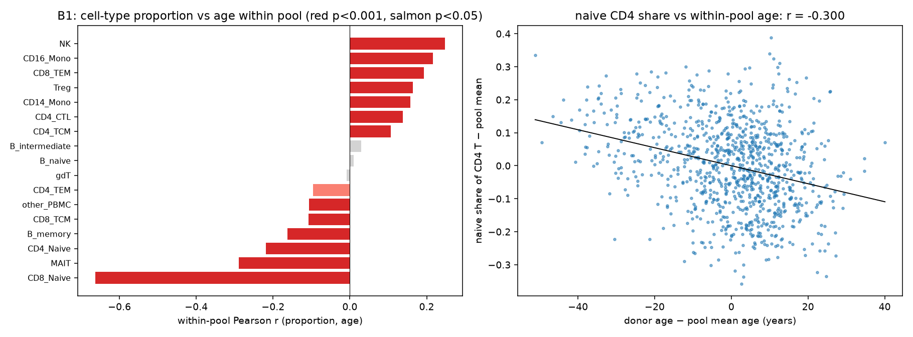
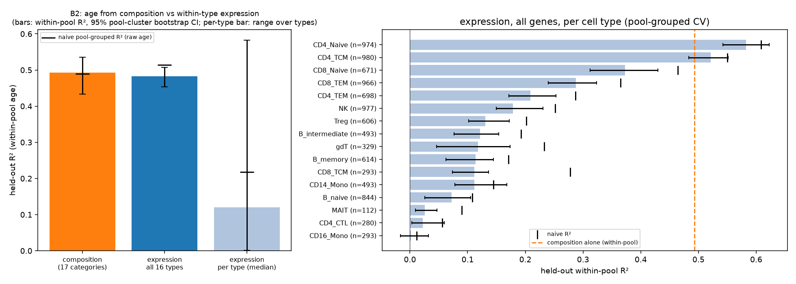
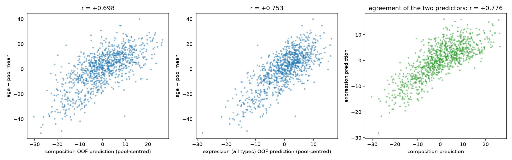
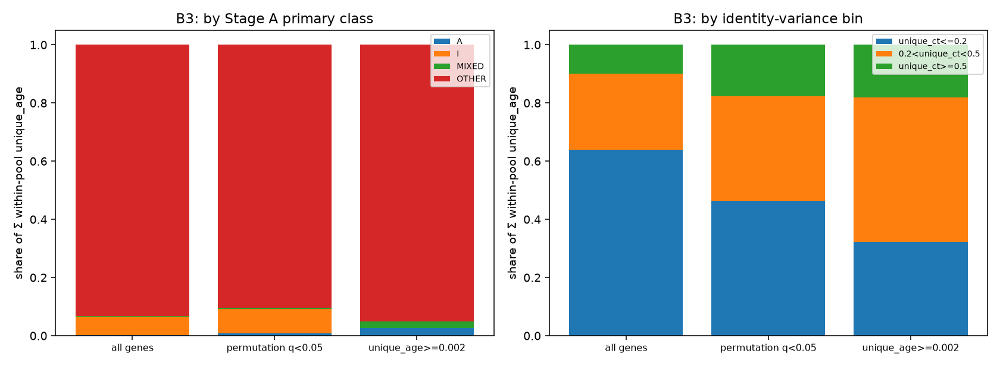

# FINDINGS_STAGEB — The compositional question (Stage B, run as measurement after STOP A)

**Status: Stage B complete. No stop condition applies (measurement only).** Run on the protocol owner's explicit instruction after the rerun
halted at STOP A (`FINDINGS_RERUN.md`). Gene sets and thresholds were **not** re-derived; `t_age` untouched; the Stage A classes are read from
`results/tables/rerun_stageA_variance_decomposition.csv`. Run date 2026-09-14; seed `20260914`. Reproduced by `notebooks/rerun_stageB_composition.ipynb`
(`src/rerun_stageB.py`; log `results/rerun/stageB_report.txt`; summary `results/rerun/stageB_summary.json`). Stages C and D remain not run; AIDA not opened.

---

## The three numbers

| | question | answer |
|---|---|---|
| **B1** | How much within-pool donor-age variance does cell-type composition alone explain? | **51.5 %** (in-sample, 16-df CLR composition on top of pool; adj R² 0.17 → 0.59; within-pool permutation null 1.7 %; F p = 7 × 10⁻¹²⁸) |
| **B2** | Pool-grouped CV: age from composition alone vs from within-cell-type expression (all 13,904 genes, unrestricted)? | **composition R² = 0.493** [0.434, 0.536] vs **all-type expression R² = 0.482** [0.454, 0.508]; MAE 8.1 y vs 8.1 y (baseline 11.2 y). Per cell type, median R² = 0.12 (best CD4 Naive 0.58). The two predictors agree at r = 0.78; combined, 0.60. |
| **B3** | Of the summed within-pool per-gene age signal, what fraction sits in MIXED/I genes vs clean A-genes? | **A-genes (2): 0.3 %. MIXED + I (1,363): 6.4 %. Neither class (OTHER, 12,539): 93.3 %.** By identity variance: 36 % of the signal is in genes with > 20 % identity variance (54 % among the 1,180 significant age genes, 68 % among the top 118). |

**Plain statement.** Age in PBMC, measured within batch, is at least half compositional: knowing only *which cell types a donor has* predicts
held-out within-pool age exactly as well as the entire transcriptome of all 16 cell types combined. What the expression models add beyond
composition is real but modest (+0.11 R²), and it comes almost entirely from the naive/central-memory T compartments — the same compartments whose
*proportions* carry the compositional signal.

---

## B1 — Composition ~ age, within pool (`results/tables/rerun_stageB_donor_composition.csv`, `…_composition_per_category.csv`, `…_composition_summary_axes.csv`)

**Construction (logged).** Proportions were computed from **all** cells of the raw OneK1K h5ad, not from the ≥ 20-cell pseudobulk groups (which would
bias proportions). Cells 1,248,980 → 1,244,937 after dropping Doublet / Platelet / Eryth / HSPC (4,043 removed). Categories: the 16 analysis types +
`other_PBMC` (ASDC, CD4/CD8 Proliferating, ILC, NK_CD56bright, Plasmablast, cDC1/2, dnT, pDC; 20,754 cells = 1.67 %). Median 1,242 cells per donor
(332–3,492). Centred log-ratio with pseudocount 0.5. Model: `age ~ C(pool) + CLR` (16 df after dropping one CLR column).

| model | R² | adj R² |
|---|---|---|
| `age ~ C(pool)` | 0.234 | 0.172 |
| `age ~ C(pool) + CLR composition` | **0.629** | **0.591** |
| increment | 0.395 of total = **51.5 % of within-pool age variance** | |
| within-pool donor-level permutation null for the increment (1,000 draws) | mean 0.013 (1.7 % of within-pool), 95th pct 0.021, max 0.034 → p < 0.001 | |

Per-category proportion vs age within pool (Pearson on pool-centred values; all |r| ≥ 0.10 have p ≤ 0.001):

| category | mean % of PBMC | r within pool | | category | mean % | r within pool |
|---|---|---|---|---|---|---|
| **CD8 Naive** | 4.1 | **−0.663** | | NK | 13.5 | **+0.248** |
| MAIT | 0.7 | −0.290 | | CD16 Mono | 1.3 | +0.216 |
| CD4 Naive | 20.6 | −0.219 | | CD8 TEM | 13.2 | +0.193 |
| B memory | 2.4 | −0.163 | | Treg | 2.1 | +0.164 |
| CD8 TCM | 1.3 | −0.108 | | CD14 Mono | 3.0 | +0.157 |
| other_PBMC | 1.7 | −0.106 | | CD4 CTL | 1.5 | +0.138 |
| CD4 TEM | 2.5 | −0.095 | | CD4 TCM | 23.0 | +0.107 |
| gdT | 1.5 | −0.009 | | B intermediate | 2.4 | +0.030 |
| B naive | 5.3 | +0.010 | | | | |

Summary axes (within pool): naive share of CD8 T **r = −0.57**; naive share of CD4 T −0.30; CD4 CTL share of CD4 T +0.18; NK share +0.25; monocyte share +0.21;
T share −0.21; naive share of B +0.08 (n.s. at p < 0.001). The compositional age axis in this cohort is the loss of naive CD8 and CD4 T cells, the loss of
MAIT cells, and the relative expansion of NK, CD16 monocytes, CD8 TEM, Treg and CD4 CTL. The pooled (uncorrected) correlations are similar (e.g. CD8 Naive
−0.68, NK +0.31): composition is not where the batch artefact lived.

---

## B2 — Pool-grouped CV: composition vs within-cell-type expression (`results/tables/rerun_stageB_cv_summary.csv`, `…_cv_results_long.csv`)

**Design.** 5-fold CV with **pools** assigned to folds (donors nest in pools; disjointness of both donors and pools asserted in every outer and inner
split), 10 repeats with different pool-to-fold assignments, 3-fold pool-grouped inner CV to choose the ridge penalty (11-point grid). Models are kernel
ridge on standardised features with an intercept (training mean). **Primary metric: within-pool R²** — features pool-centred (unsupervised), target = age
− pool mean age, held-out predictions re-centred within each held-out pool — because the corrected age axis is within-pool and because an unseen pool's
mean age is unpredictable by design. **Secondary: "naive" R²** on raw age with un-centred features (what a pool-grouped clock would report; it includes
whatever between-pool structure — true age or batch/depth — transfers to unseen pools). CIs: pool-cluster bootstrap (2,000 draws) of the repeat-0
out-of-fold predictions; the min–max over the 10 repeats is also given. Within-pool age SD = 14.45 y; predicting the pool mean gives MAE 11.23 y.

| model | n | **within-pool R²** [95 % CI] {repeat range} | MAE (y) | naive R² [CI] | naive MAE |
|---|---|---|---|---|---|
| **composition alone** (CLR, 17 categories) | 981 donors | **0.493** [0.434, 0.536] {0.487–0.499} | 8.08 | 0.489 [0.431, 0.538] | 9.44 |
| **expression, all 16 cell types jointly** (13,904 genes × 16 types) | 981 donors | **0.482** [0.454, 0.508] {0.477–0.488} | 8.12 | 0.514 [0.486, 0.555] | 9.12 |
| expression, per cell type — median over 16 types | | **0.120** (range 0.002–0.583) | | 0.217 | |
| paired difference, all-type expression − composition, over 10 repeats | | **−0.011** (−0.016 … −0.005) | | | |
| within-pool age shuffle (one draw, pipeline check) | | composition +0.001; all-type expression +0.000; per-type median −0.002 | | | |

Per cell type (expression, all genes, within-pool R² [CI]; naive R²):

| cell type | n | within-pool R² | naive R² | | cell type | n | within-pool R² | naive R² |
|---|---|---|---|---|---|---|---|---|
| **CD4 Naive** | 974 | **0.583** [0.542, 0.622] | 0.609 | | Treg | 606 | 0.131 [0.102, 0.172] | 0.202 |
| **CD4 TCM** | 980 | **0.521** [0.483, 0.551] | 0.550 | | B intermediate | 493 | 0.121 [0.076, 0.154] | 0.193 |
| CD8 Naive | 671 | 0.373 [0.312, 0.429] | 0.464 | | gdT | 329 | 0.118 [0.046, 0.174] | 0.233 |
| CD8 TEM | 966 | 0.288 [0.240, 0.323] | 0.365 | | B memory | 614 | 0.113 [0.063, 0.145] | 0.170 |
| CD4 TEM | 698 | 0.209 [0.171, 0.253] | 0.287 | | CD8 TCM | 293 | 0.111 [0.073, 0.136] | 0.278 |
| NK | 977 | 0.179 [0.149, 0.230] | 0.252 | | CD14 Mono | 493 | 0.111 [0.078, 0.168] | 0.145 |
| | | | | | B naive | 844 | 0.072 [0.026, 0.105] | 0.108 |
| | | | | | MAIT | 112 | 0.026 [0.009, 0.047] | 0.089 |
| | | | | | CD4 CTL | 280 | 0.022 [0.003, 0.060] | 0.056 |
| | | | | | CD16 Mono | 293 | 0.002 [−0.016, 0.032] | 0.011 |

**B2c. Are the two predictors redundant?** (linear recombination of the repeat-0 out-of-fold predictions; 1–2 in-sample coefficients on 981 donors)

| predictor(s) of within-pool age | R² |
|---|---|
| composition OOF prediction | 0.487 (r = 0.698) |
| all-type expression OOF prediction | 0.568 (r = 0.753) — the raw held-out R² of 0.482 is lower because ridge over-shrinks; one rescaling coefficient recovers 0.568 |
| both | **0.599** — gain over composition alone **+0.113**; over expression alone +0.032 |
| correlation between the two predictions | **+0.776** |

**Reading B2.**
- On the calibrated held-out metric the two information sources are indistinguishable (0.493 vs 0.482, composition consistently 0.01 ahead across all 10
  repeats). On rank agreement the expression model is somewhat better (r 0.75 vs 0.70). Either way, **17 numbers describing which cells a donor has do as
  well as 222,000 expression features describing what those cells express.**
- They largely encode the same thing (r = 0.78 between predictions; ~0.45 of the 0.60 combined R² is shared). Expression carries a non-redundant
  increment of ~0.11 R² — real, and the only part of the within-type transcriptome that is *not* accounted for by composition.
- Within-type age information is concentrated in the naive / central-memory T compartments (CD4 Naive 0.58, CD4 TCM 0.52, CD8 Naive 0.37, CD8 TEM 0.29) and
  is near zero in CD16 monocytes, CD4 CTL, MAIT, and weak in B cells and monocytes. These are the same compartments whose *proportions* drive B1. Whether the
  within-"CD4 Naive" signal is cell-intrinsic aging or sub-compositional drift within the Azimuth label (e.g. recent-thymic-emigrant vs aged naive cells;
  LRRN3 falls with age *within* CD4 Naive at r = −0.42, Stage A3) cannot be decided with L2 labels. Stage B does not resolve it and does not claim to.
- Naive R² exceeds within-pool R² for every expression model (median 0.22 vs 0.12; CD8 TCM 0.28 vs 0.11; gdT 0.23 vs 0.12) but not for composition
  (0.489 vs 0.493). The excess is between-pool structure that transfers to unseen pools, which for expression mixes true age with the depth/batch
  artefact documented in Stage A and the prior run; for composition there is no such artefact. A pool-grouped expression clock evaluated on raw age would
  therefore still overstate within-type age signal on this cohort.

---

## B3 — Where the per-gene within-pool age signal sits (`results/tables/rerun_stageB_age_signal_by_class.csv`)

Summed Stage A `unique_age` (within-pool, depth-adjusted fraction of each gene's variance explained by age; total over 13,904 genes = 3.59), and the same
in absolute log₂-CPM variance units (Σ `unique_age` × gene variance). Classes are the Stage A primary classes, unchanged.

| grouping | group | n genes | share of Σ unique_age | share of Σ absolute age variance |
|---|---|---|---|---|
| Stage A class | **A** | 2 | **0.3 %** | 0.2 % |
| | **MIXED** | 1 | **0.2 %** | 0.4 % |
| | **I** | 1,362 | **6.2 %** | 8.9 % |
| | OTHER | 12,539 | 93.3 % | 90.5 % |
| identity bin | unique_ct ≤ 0.2 (A-eligible) | 9,423 (67.8 %) | 63.8 % | 61.6 % |
| | 0.2 < unique_ct < 0.5 | 3,052 (22.0 %) | 26.3 % | 24.8 % |
| | unique_ct ≥ 0.5 (MIXED-eligible) | 1,429 (10.3 %) | 9.9 % | 13.5 % |

Restricted to the 1,180 genes with a detectable within-pool age association (permutation q < 0.05): A 0.7 %, MIXED 0.6 %, I 8.4 %, OTHER 90.3 %; by identity
bin 46.4 % / 35.9 % / 17.7 % (absolute units 43.8 / 32.8 / 23.4 %). Restricted to the 118 genes with `unique_age ≥ 0.002`: A 2.7 %, MIXED 2.1 %, OTHER
95.2 %; by identity bin 32.3 % / 49.7 % / 18.1 %.

**Reading B3.** MIXED + I genes hold ~20× more of the summed within-pool age signal than the clean A-genes (6.4 % vs 0.3 %), but the honest headline is that
**> 90 % sits in genes that are neither** — genes with too little age variance to be A and too little identity variance to be I. The per-gene A/I/MIXED
construct partitions almost none of the age signal. Along the continuous identity axis the picture is graded: the genome-wide age signal is distributed
roughly in proportion to gene counts (64 / 26 / 10 % vs 68 / 22 / 10 % of genes), but among genes that actually carry detectable age signal the
high-identity bins are over-represented (54 % of the signal in genes with > 20 % identity variance, vs 32 % of all genes), and among the strongest age
genes 68 %. Caveat: this is an accounting of marginal per-gene effects, not of multivariate predictability — B2 and the not-run Stage C/D cross-test are
the multivariate tests.

---

## Is age in PBMC mostly compositional? Yes, at least half — and what that implies for separability

**Direct answer.** Within batch, half of donor age variance in OneK1K PBMC is explained by cell-type proportions alone (B1: 51.5 % in-sample; B2: held-out
R² 0.49). The entire within-cell-type transcriptome of all 16 types predicts held-out age no better (0.48). The two predictors share most of their
information (r = 0.78). Expression contributes a genuine non-compositional increment of about 0.11 R², concentrated in the naive and central-memory T
compartments. Age in this tissue is therefore **predominantly a change in which cells are present** — the loss of naive CD8 and CD4 T cells and MAIT cells
and the relative expansion of NK, CD16 monocytes, CD8 TEM, Treg and CD4 CTL — with a secondary within-type component whose cell-intrinsic vs
sub-compositional nature is unresolved.

**What this implies for "age and identity are separable axes in PBMC expression space".**
1. **At the tissue (donor) level they are not separable.** The best single age predictor *is* an identity variable (composition). Any donor-level PBMC age
   score — bulk or pseudobulk — is dominated by identity. Stage A already showed the per-gene A-gene construct is empty (2 genes); B3 shows those 2 genes
   carry 0.3 % of the within-pool age signal; B2 shows the transcriptome-wide signal is redundant with composition to within 0.01 R².
2. **At the within-cell-type level the question is still open, but Stage B makes a prediction.** The residual expression signal (≈ 0.11 R² beyond
   composition; R² 0.58 inside CD4 Naive) lives in the compartments that are themselves defined by identity programmes, and Stage A found the significant
   within-pool age genes enriched 2.5× among high-identity genes with every classic bulk-blood age marker (CCR7, LEF1, NELL2, GZMH, B3GAT1, KLRG1) being an
   I-gene. The pre-registered Stage D cross-test (`FALSIFICATION.md`: age predicted from I-genes vs from A-genes) is therefore expected to **falsify**
   separability — I-genes should predict within-type age about as well as any age-selected set, because the age signal runs through identity genes. This
   is a prediction from B, not a result; C/D were not run.
3. **For the project's goal — "rejuvenation without identity loss" in PBMC.** If half of a PBMC age score is composition, then any intervention that moves
   a donor-level PBMC age score toward "young" has, by construction, changed the tissue's identity (restored naive T cells, reduced NK/CTL/CD16 monocytes).
   That is not identity *loss* per cell, but it means a donor-level age score cannot certify "identity preserved". A within-cell-type age score is the only
   place the two axes could be pulled apart, and there the achievable signal is R² ≈ 0.1–0.6 depending on type, is strongest exactly where sub-compositional
   drift (naive-compartment heterogeneity) is most plausible, and is carried by identity-leaning genes. The benchmark's construct needs to be defined
   *within* a cell type and needs finer-than-L2 identity resolution before "separable" can even be tested cleanly.

**Negative and cautionary results, reported with equal weight.**
- Composition beats or matches expression on every held-out metric; the paired difference is small (−0.011) but has the same sign in all 10 repeats.
- Four cell types carry essentially no within-type age signal (CD16 Mono 0.00, CD4 CTL 0.02, MAIT 0.03, B naive 0.07); monocytes and B cells in general are
  weak (≤ 0.13). Within-type "transcriptomic age" in PBMC is a T-cell phenomenon.
- The all-type expression model is over-shrunk (held-out R² 0.48 vs 0.57 after one rescaling coefficient); the per-type models are likely similarly
  conservative. This does not change the composition-vs-expression comparison qualitatively (0.487 vs 0.568 vs 0.599 combined, all in the same table).
- One within-pool shuffle per model returns R² ≈ 0 — the CV pipeline does not leak; this is a pipeline check, not the Stage D control.
- The "naive" raw-age R² is reported but should not be used for within-type claims on this cohort (see B2 reading, last bullet).
- B3's dominant category is OTHER: the per-gene classification, at any of the pre-registered thresholds, does not partition the age signal.

---

## Methods notes
- **Why CLR?** Proportions are compositional (sum to 1); CLR removes the unit-sum constraint and makes the linear model well-posed. One CLR column is dropped
  for full rank (16 df). The per-category correlations are on raw proportions for readability.
- **Why within-pool R²?** The corrected age axis (Stage A) is within pool; between-pool age differences are confounded with batch and their mean is by
  construction unlearnable for a held-out pool. Features are pool-centred using only the features themselves (no labels); held-out predictions are
  re-centred within the held-out pool using only the predictions. The bootstrap resamples pools (the exchangeable unit under pool-grouped CV) with
  predictions centred once, not per resample.
- **Why kernel ridge?** With p = 13,904 ≫ n ≤ 980 per type, the dual form lets one n × n kernel per type serve all 10 × 5 × (3 + 1) fits; the penalty grid
  is on the scale of the mean kernel diagonal.
- **Depth covariates** are not in the B2 expression models explicitly; pool-centring removes the pool-level depth component (R² 0.86 of depth is pool).
  Residual within-pool depth variation could contribute to the naive/TCM T-cell R²; Stage A found depth added nothing beyond pool at the per-gene level.
- The B2 composition model uses 17 categories including `other_PBMC`; the B1 in-sample model uses the same CLR.
- Wall time ≈ 24 min (kernels 16 × ≤ 980² × 13,904; 7,200 eigendecompositions ≤ 800 × 800; 2,000-draw bootstraps).

## Files produced
| path | content |
|---|---|
| `src/rerun_stageB.py`, `notebooks/rerun_stageB_composition.ipynb` | code and executed notebook |
| `results/rerun/stageB_report.txt`, `stageB_summary.json`, `nb_stageB_exec.log` | log, machine-readable summary |
| `results/tables/rerun_stageB_donor_composition.csv` | per-donor counts → proportions and CLR (17 categories), age, pool, within-pool age |
| `results/tables/rerun_stageB_composition_per_category.csv`, `…_composition_summary_axes.csv` | B1 |
| `results/tables/rerun_stageB_cv_results_long.csv`, `…_cv_summary.csv` | B2, every repeat × model × cell type; summary with CIs |
| `results/tables/rerun_stageB_age_signal_by_class.csv` | B3 |
| `results/figures/rerun_stageB_composition_vs_age.png`, `…_cv_composition_vs_expression.png`, `…_oof_predictions.png`, `…_age_signal_by_class.png` | figures |
